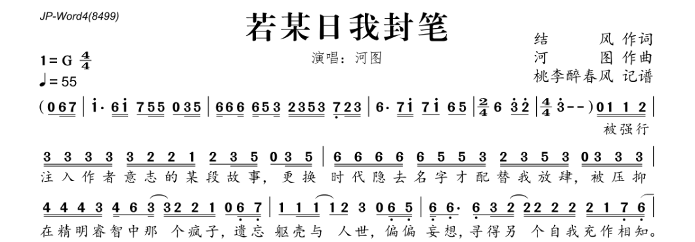

# ABC 记谱法

- [ABC 记谱法](https://zh.wikipedia.org/wiki/ABC%E8%AE%B0%E8%B0%B1%E6%B3%95)
- [abcnotation](https://abcnotation.com/)

使用文本和一系列的规则，来表示和存储音乐的一种方法。

## 语法规则

### 表头部分

```md
"X:"" 曲目 1...n, abc 允许多个曲目在同一个文件中

"T:" 曲名

"C:" 作者
```

`X:` 表头的开始 和 `K:` 表头的结尾，必须存在，其余参数在这两个参数之间(可有可无)，并且顺序任意。

`M:`，`M:`，`Q:` 这三个参数很重要，建议始终都填写

### 表主体部分

### 杂项

`%`后面的内容表示注释

```md
T: 永定四十年 % 这首曲子很好听
```

## 举例

### 简谱



### 使用 abc 记谱

```md
X: 1 % 曲目，当前为第一首
T: 若某日我封笔 % 曲名
C: 河图
M: 4/4 % 拍号
L: 1/8 % 单个音符的时值，此时字母 C，就表示 八分音符的 C, C/2为十六分音符的C，C2 为四分音符的C, 此处为 1/8 是为了记谱方便，当前谱子多数音的时值都是八分音符

Q: 1/4=55 % bpm 四分音符，表示 一分钟内有55个四分音符
K: G % 调号
|: G G A B B B B B A A G A2 B D Z B D :|
```

<render-abc :abc="`
X: 1 
T: 若某日我封笔
M: 4/4 
L: 1/8 
Q: 1/4=55
K: G % 调号
|: G G A B B B B B A A G A2 B D Z B D :|
`"></render-abc>

### 使用 abc 记谱 L 值不同

此处是为了比较 `L: 1/8` 和 `L: 1/4` 时，谱子的写法，最终渲染效果是一致的。

```md
X: 2 % 曲目，当前为第2首
T: 若某日我封笔
M: 4/4 % 拍号
L: 1/4 % 单个音符的时值，此时字母 C，就表示 四分音符的C, C/2 为八分音符的 C， C2 为二分音符的C
Q: 1/4=55 %bpm 四分音符，表示 一分钟内有55个四分音符
K: G % 调号
|: G/2 G/2 A/2 B/2 B/2 B/2 B/2 B/2 A/2 A/2 G/2 A B/2 D/2 Z B/2 D/2 :| % 就只能这样写来
```

<render-abc :abc="`
X: 2
T: 若某日我封笔
M: 4/4
L: 1/4
Q: 1/4=55 
K: G % 调号
|: G/2 G/2 A/2 B/2 B/2 B/2 B/2 B/2 A/2 A/2 G/2 A B/2 D/2 Z B/2 D/2 :|
`"></render-abc>
