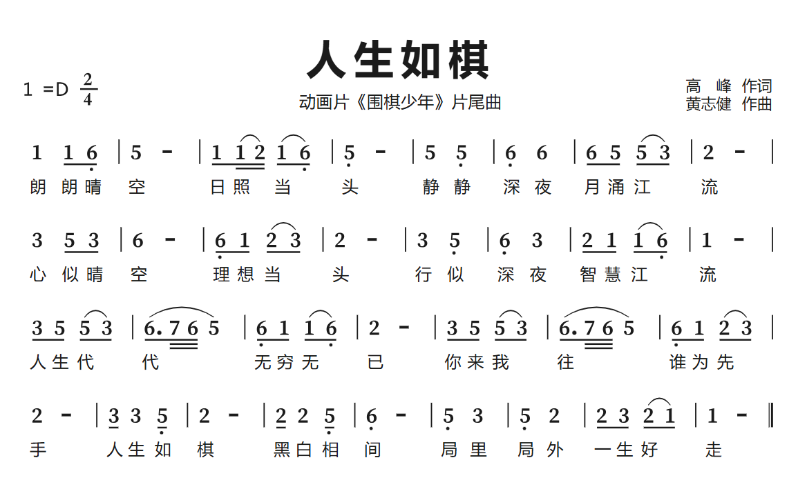

# ABC 记谱法

- [ABC 记谱法](https://zh.wikipedia.org/wiki/ABC%E8%AE%B0%E8%B0%B1%E6%B3%95)
- [abcnotation](https://abcnotation.com/)

使用文本和一系列的规则，来表示和存储音乐的一种方法。

## 语法规则

### 表头部分

```md
"X:"" 曲目 1...n, abc 允许多个曲目在同一个文件中
"M:" 拍号
"L:" 单位时值
"Q:" 曲目速度
"K:" 调性， C大调,E大调.... 升是 #, 降是 b 如 C# 升C大调 Db 降D大调， 还可以加调式 如 K:C lydian， 还能指定某音升高或降低半音 如 K:C^d 表示C大调, d 音要升半音，降低是用 \_
```

`X:` 表头的开始 和 `K:` 表头的结尾，必须存在。

`M:`，`L:`，`Q:` 这三个参数很重要，建议始终都填写,并且建议单位时值始终是 `L:1/4` 四分音符

其余参数在这 `X:` 和 `K:`之间(可有可无)，并且顺序任意。

```md
"T:" 曲名
"C:" 作者
"D: 专辑名
"S:" 来源
"Z:" 译注
"A:" 地区
"B:" 书名
"R:" 节奏
"P:" 音乐段落结构
```

### 表主体部分

#### 音符

一般而言钢琴有 88 个按键，划分为不同的组，分别是大字二组、大字组、小字组、小字一组、小字二组、小字三组、小字四组、小字五组


在 ABC 记谱法中，使用大写字母`C、D、E、F、G、A、B` 表示小字一组的音符，使用小写字母 `c、d、e、f、g、a、b` 表示小字二组的音符。

更低的音，在大写字母后面添加 `,` 来表示，如 `C,` 小字组的 `C`， `C,,` 大字组的 `C` 依次类推

更高的音，在小写字母后面添加 `'` 来表示，如 `c'` 小字二组的 `C`， `c''` 小字三组的 `C` 依次类推

大写字母 `Z` 表示整小节休止中的休止符， 小写字母 `z` 表示休止符

下面时值，用 `C` 代指**所有基本音符**，这里说的音符，而不是音名，是因为跟钢琴的乐理概念并不一致

#### 时值和时长

时值是指单个音符所代表的**相对**的持续时间，如全音符、二分音符、四分音符、八分音符、十六分音符，依次类推， 并且全音符是二分音符的时长的两倍，二分音符是四分音符时长的两倍，只是相对关系。

时长是指单个音符所代表的**实际**的持续时间，一般会用 bpm 来表示 。

bpm 是指每分钟节拍数， 默认是以**四分音符**计算，如 120 bpm 表示每一分钟有 120 个四分音符，那么每个四分音符实际的持续时长为 60/120 = 0.5 秒

在 ABC 记谱法中，有两个关键的字段 `L:1/n` 和 `Q:1/m=r`，

`L` 字段表示基本音符 C 代表 n 分音符 `(n = 1 2 4 8 16 32 ...)`

那么表示其他的时值，就需要乘以一个分数，即`Cx/y` `(x为正整数, y = 1 2 4 8 16 32 ...)`, 支持简写形式，如 `C4/2` 可以简写成 `C2` ，`C1/4` 简写为 `C/4`

`Q` 表示 bpm，即每分钟有 r 个 m 分音符 `(m = 1 2 4 8 16 32 ...)`， 即 m 分音符的实际时长为 `y/60` 秒

那么时值的公式就是 `(1 * x ) / (n * y)`， 得出对应的时值

那么 m 分音符时长的公式就是 `60 / r`，如果换算成四分音符的时长为 `(4 * 60) / (r * m)`

理论上 `L` 的参数设置并不会真正影响 ABC 记谱法的实际渲染结果，因为当 `L:1/4` 时，想要表示一个四分音符，需要写成 `C` ,当 `L:1/8` 时，想要表示一个四分音符，则应该写成 `C2`, **为了记谱方便计算和统一，建议 n 和 m 始终应该取值为 4**

### 杂项

`%`后面的内容表示注释

```md
T: 人生如棋 % 这首曲子很好听
```

D E F G A B C
1 2 3 4 5 6 7

## 举例

### 简谱



### 使用 abc 记谱

```md
X: 1
T: 人生如棋
C: 高峰、黄志健
M: 2/4 % 拍号
L: 1/4 % 单个音符的时值，此时字母 C，就表示 四分音符的 C, C/2为八分音符的C，C2 为二分音符的C
Q: 1/4=66 % bpm 四分音符，表示 一分钟内有66个四分音符
K: D % 调号
D D/2 B,/2 | A z | D/2 D/4 E/4 D,/2 B,/2 | A, z | A A, | B, B | B/2 A/2 A/2 F/2 | E z |
F A/2 F/2 | B z | B,/2 D/2 E/2 F/2 | E z | F A, | B, F | E/2 D/2 D/2 B,/2 | D z |
F/2 A/2 A/2 F/2 | B3/4 C/8 B/8 A | B,/2 D/2 D/2 B,/2 | E z | F/2 A/2 A/2 F/2 | B3/4 C/8 B/8 A | B,/2, D/2 E/2 F/2 |
E z | F/2 F A,/2 | E z | E/2 E A,/2 | B, z | A, F | A, E | E/2 F/2 E/2 D/2 | D z |
```

<render-abc :abc="`
X: 1
T: 人生如棋
C: 高峰、黄志健
M: 2/4 % 拍号
L: 1/4 % 单个音符的时值，此时字母 C，就表示 四分音符的 C, C/2为八分音符的C，C2 为二分音符的C
Q: 1/4=66 % bpm 四分音符，表示 一分钟内有66个四分音符
K: D % 调号
D D/2 B,/2 | A z | D/2 D/4 E/4 D,/2 B,/2 | A, z | A A, | B, B | B/2 A/2 A/2 F/2 | E z |
F A/2 F/2 | B z | B,/2 D/2 E/2 F/2 | E z | F A, | B, F | E/2 D/2 D/2 B,/2 | D z |
F/2 A/2 A/2 F/2 | B3/4 C/8 B/8 A | B,/2 D/2 D/2 B,/2 | E z | F/2 A/2 A/2 F/2 | B3/4 C/8 B/8 A | B,/2, D/2 E/2 F/2 |
E z | F/2 F A,/2 | E z | E/2 E A,/2 | B, z | A, F | A, E | E/2 F/2 E/2 D/2 | D z |
`" :isplay="true"></render-abc>
