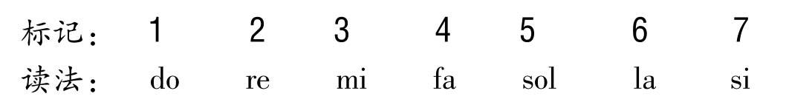
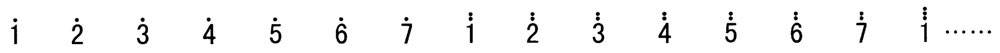
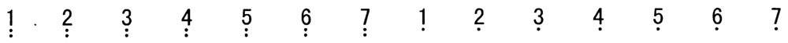
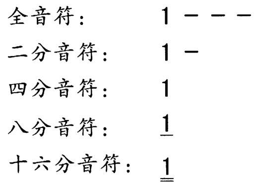
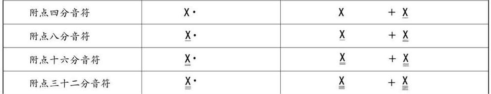

# 简谱/月琴简谱符号

## 简谱的书写格式

简谱采用的是首调唱名法。

名称，上方居中
作词、作曲，右上方
调号、拍号、速度、力度、表情，左上方
小节线、各音符为主体。

基本音符

高一个八度，就在对应数字上加一个点
低一个八度，就在对应数字下加一个点

休止符，用数字 0 表示。

音的时长

音越长，就在对应数字右边加短横线,一条短横线，称为增时线，即增加一个四分音符
音越多，就在对应数字下面加短横线，称为减时线，即减少之前时长的一半。

增时线和减时线，也可以作用在休止符上。

附点音符: 简谱中的附点音符只作用在四分音符及其时长更小的音符上，表示增加该音符的一半时长。

附点音符也可以作用在休止符上。

