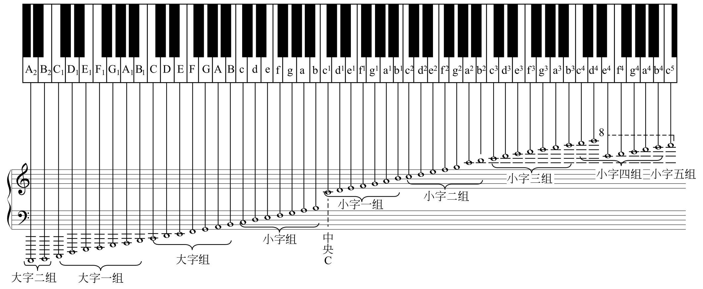

# 基础乐理

## 标准 A 音

标准 A 音的频率是 440Hz 。

## 基本音级

最常用的是几个音级，他们固定的名称是： C、D、E、F、G、A、B。

[为什么现代音乐基本都是七音？](https://www.zhihu.com/question/422152293)

## 八度与十二平均律

八度：一个音的频率是另一个音的两倍，他们之间的跨度叫做“八度”。
十二平均律：将一个八度“近似等距离”分成十二份，音高过渡平滑，转调时音程之间比较和谐。

[十二平均律-维基百科](https://zh.wikipedia.org/wiki/%E5%8D%81%E4%BA%8C%E5%B9%B3%E5%9D%87%E5%BE%8B)
[人们为什么选择了十二平均律？](https://zhuanlan.zhihu.com/p/140709959)

### 钢琴

乐音体系中有 97 个音，而钢琴一般为 88 个。

[为什么学音乐的人都要练钢琴？-知乎](https://www.zhihu.com/question/38685291)

在钢琴中除了，**赫姆霍兹音高记法**（大字组，小字组，小字一组...) ，还有 **科学音高记法**。

所以钢琴中的中央 C 音，在赫姆霍兹音高记法中被记做 c^1^，也就是小字一组的 C 音，但在科学音高记法中，被记做 C4。

[【即兴乐理】03、键盘琴键标记](https://www.bilibili.com/read/cv15413063/)

## 唱名/唱名法

唱名即：do re mi fa so la xi
唱名法分为：
* 固定调唱名法：唱名跟调号一一对应，不发生变化， C 唱 do，D 唱 re，E 唱 mi ...
* 首调唱名法：唱名可以随着调号变化而变化。
   C 唱 do，D 唱 re， E 唱 mi，F 唱 fa，A 唱 so ...
   但 D 也可以唱 do，此时 E 唱 re，#F（升F） 唱 mi， G 唱 fa ...

## 五线谱/简谱

五线谱和简谱是两种记谱体系，一般而言五线谱更加直观，方便操作乐器，而简谱更适合声乐。

PS：简谱起源于法国。

[简谱-wiki](https://zh.wikipedia.org/wiki/%E7%AE%80%E8%B0%B1)
[为何五线谱较简谱在国际上更流行？](https://www.zhihu.com/question/20124726)

